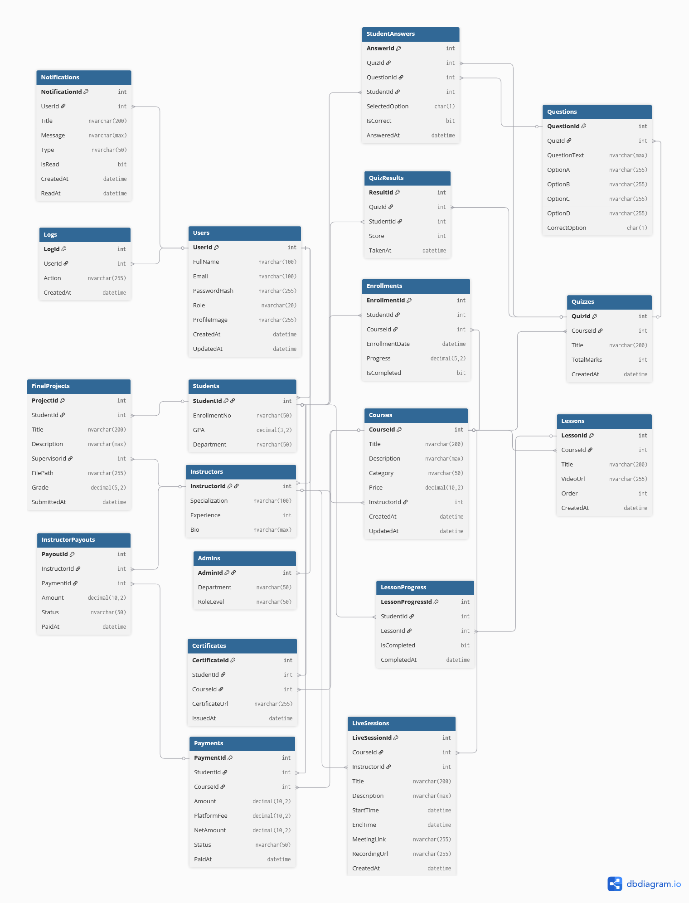

# 📚 Learnify – Learning Management System
### Full-Stack LMS | ASP.NET Core Web API + React (Vite + TypeScript) + SQL Server

Learnify is a modern and scalable Learning Management System enabling students to enroll in courses, instructors to manage learning content and quizzes, and administrators to oversee users and system analytics. It supports secure authentication, protected role-based dashboards, payments, certificates, progress tracking, real-time notifications, and advanced course management.

---

## 🚀 Tech Stack

### 🖥 Backend – ASP.NET Core Web API
- ASP.NET Core 8 Web API
- Entity Framework Core
- SQL Server / EF Core Migrations
- Identity Framework + JWT Authentication
- REST API architecture
- SMTP Email Service
- DTOs & ViewModels for clean data communication
- Swagger documentation
- Dependency Injection
- AutoMapper
- LINQ & Async programming

### 💻 Frontend – Vite + React + TypeScript
- React 18 + Vite
- TypeScript + TSX
- Axios & React Query (data fetching + caching)
- Zustand (state management)
- React Router DOM (routing & protected routes)
- TailwindCSS + ShadCN UI + Radix UI
- Context API for authentication
- Toast notifications & UI modals

---

## 📌 System Roles & Capabilities
| Role | Permissions |
|------|------------|
| **Admin** | Manage Courses, Users, Payments, Feedback, Global dashboard |
| **Instructor** | Create Lessons, Quizzes, Track students, Revenue and payouts |
| **Student** | Enroll, Study lessons, Attempt quizzes, Earn certificates, Cart & checkout |

---

## 🧠 Core Features

### 👨‍🎓 Student Module
- Browse and enroll in courses
- Track lesson progress
- Take quizzes & view results
- Download certificates
- Shopping cart & checkout
- Saved courses / Wishlist
- Notifications system

### 👨‍🏫 Instructor Module
- Create & manage courses
- Create lessons & upload attachments
- Create quizzes with multiple questions
- Monitor enrolled students
- Instructor profile and financials

### 🛠 Admin Module
- Dashboard analytics
- Manage all users & roles
- Manage courses and payments
- Platform-wide settings

### 🔐 Authentication & Security
- JWT Access & Refresh tokens
- Role-based authorization
- Email verification
- Forgot / Reset password
- LocalStorage + Cookies

---

## 🏗 Project Structure

### Backend (.NET API)

``` 
Learnify API/
├── Connected Services/
├── Dependencies/
├── wwwroot/
├── Areas/
├── Controllers/
│   ├── AdminController.cs
│   ├── CourseController.cs
│   ├── DashboardController.cs
│   ├── InstructorController.cs
│   ├── NotificationController.cs
│   ├── OthersController.cs
│   ├── ProfileController.cs
│   ├── QuizController.cs
│   ├── SettingsController.cs
│   └── StudentController.cs
├── Data/
│   ├── DTOs/
│   │   ├── AuthDTOs.cs
│   │   └── AuthUserInfoDTO.cs
│   └── NotificationDTO.cs
├── Models/
│   ├── Admin.cs
│   ├── AppUser.cs
│   ├── CartItem.cs
│   ├── Certificate.cs
│   ├── Checkout.cs
│   ├── Dashboard.cs
│   ├── Enrollment.cs
│   ├── Feedback.cs
│   ├── Instructor.cs
│   ├── InstructorPayout.cs
│   ├── Lesson.cs
│   ├── LessonProgress.cs
│   ├── Log.cs
│   ├── Notification.cs
│   ├── Profile.cs
│   ├── Question.cs
│   ├── Quiz.cs
│   ├── SavedCourse.cs
│   ├── Student.cs
│   └── User.cs
├── Services/
│   ├── AdminService.cs
│   ├── AuthService.cs
│   ├── CheckoutService.cs
│   ├── CourseService.cs
│   ├── DashboardService.cs
│   ├── EmailSender.cs
│   ├── EmailService.cs
│   ├── EmailSetting.cs
│   ├── FeedbackService.cs
│   ├── IEmailService.cs
│   ├── INotificationService.cs
│   ├── InstructorService.cs
│   ├── LessonService.cs
│   ├── NotificationService.cs
│   ├── ProfileService.cs
│   ├── QuestionService.cs
│   ├── QuizService.cs
│   ├── StudentService.cs
│   └── UserSettingsService.cs
├── StaticRoles.cs
├── UserRoles.cs
├── ViewModels/
│   ├── Auth/
│   │   └── LoginVM.cs
│   ├── AdminDashboardVM.cs
│   ├── CourseVM.cs
│   ├── FeedbackVM.cs
│   ├── InstructorDashboardVM.cs
│   ├── ProfileVM.cs
│   ├── QuestionOptionVM.cs
│   ├── QuestionVMs.cs
│   ├── QuizVMs.cs
│   ├── StudentDashboardVM.cs
│   ├── StudentVM.cs
│   └── UserSettingsVM.cs
├── AppDbContext.cs
├── AppDbInitializer.cs
├── Migrations/
├── Pages/
├── appsettings.json
├── Learnify.API.http
├── Program.cs
└── ScaffoldingReadMe.txt
``` 

### Frontend (React Vite)

``` 
Learnify Frontend (Vite React TSX)/
├── public/
│   ├── src/  (Note: This appears to be a non-standard nesting; likely assets or build artifacts)
│   │   ├── API/
│   │   │   └── assets/
│   │   ├── Configs/
│   │   ├── URLs.js
│   │   ├── assets/
│   │   ├── Constants.ts
│   │   ├── NavLinks.ts
│   │   ├── Logo/
│   │   └── authM.webp
│   ├── index.html
│   └── ... (other static assets like favicon.ico)
├── src/
│   ├── components/
│   │   ├── AdminLayout.jsx
│   │   ├── AppSidebar.jsx
│   │   ├── UserData/
│   │   │   └── UserData.ts
│   │   ├── app-sidebar.tsx
│   │   ├── nav-main.tsx
│   │   ├── nav-user.tsx
│   │   ├── team-switch.tsx
│   │   ├── Auth/
│   │   │   ├── AuthLayout.tsx
│   │   │   ├── AuthLayout/  (subfolder)
│   │   │   │   └── AuthLayout.tsx
│   │   │   └── SocialButton/
│   │   │       └── SocialButton.tsx
│   │   ├── Footer/
│   │   │   └── Footer.tsx
│   │   ├── InstructorLayout/
│   │   │   ├── InstructorLayout.jsx
│   │   │   ├── LandingCard/
│   │   │   ├── AboutCard/
│   │   │   ├── CourseCard/
│   │   │   ├── FeaturesCard/
│   │   │   ├── Hero/
│   │   │   ├── LandingFooter/
│   │   │   ├── LandingHeading/
│   │   │   ├── LandingLayout/
│   │   │   ├── Navbar/
│   │   │   ├── Parametric/
│   │   │   ├── LogoSVG/
│   │   │   ├── MenuBarDemo.jsx
│   │   │   └── SideNavbar/
│   │   │       └── Navbar.jsx
│   │   ├── LandingSVG/
│   │   ├── LogoSVG/
│   │   ├── Menubar/
│   │   ├── SideNavbar/
│   │   ├── StudentLayout/
│   │   │   └── StudentLayout.jsx
│   │   ├── ui/
│   │   │   └── UserLayout/
│   │   │       └── UserLayout.jsx
│   │   └── UserLayout/
│   │       └── UserLayout.jsx  (possible duplicate/alias)
│   ├── hooks/
│   │   ├── use-mobile.ts
│   │   ├── useAdmin.ts
│   │   ├── useAuth.ts
│   │   ├── useCountries.ts
│   │   ├── useDashboard.ts
│   │   ├── useFeedback.ts
│   │   ├── useLesson.ts
│   │   ├── useLocalStorage.ts
│   │   ├── useNotification.ts
│   │   ├── useProfile.ts
│   │   ├── useQuiz.ts
│   │   ├── useStudent.ts
│   │   └── useUser.ts
│   ├── lib/
│   │   ├── routes.ts
│   │   ├── Router.tsx
│   │   └── Classes/
│   │       ├── app.ts
│   │       ├── useAuth.ts
│   │       └── user.ts
│   ├── routes/
│   │   └── ... (route definitions, e.g., Router.tsx)
│   ├── store/
│   │   └── ... (state management, e.g., Redux/Zustand files)
│   ├── utils/
│   │   ├── ConfirmToast.jsx
│   │   ├── SelectStyles.ts
│   │   └── ThemeProvider.tsx
│   ├── views/
│   │   ├── Admin/
│   │   │   ├── AdminDashboard.jsx
│   │   │   ├── AdminPayments.jsx
│   │   │   ├── AdminProfile.jsx
│   │   │   ├── CourseManagement.jsx
│   │   │   └── UserManagement.jsx
│   │   ├── Auth/
│   │   │   ├── Register/
│   │   │   │   └── Register.jsx
│   │   │   ├── ForgotPassword.jsx
│   │   │   ├── InstructorRegister.jsx
│   │   │   ├── ResendVerification.jsx
│   │   │   ├── ResetPassword.jsx
│   │   │   └── VerifyEmail.jsx
│   │   ├── Instructor/
│   │   │   ├── AllStudents.jsx
│   │   │   ├── CreateCourse.jsx
│   │   │   ├── CreateLesson.jsx
│   │   │   ├── CreateQuestions.jsx
│   │   │   ├── CreateQuiz.jsx
│   │   │   ├── EditLesson.jsx
│   │   │   ├── EditQuiz.jsx
│   │   │   ├── InstDashboard.jsx
│   │   │   ├── InstProfile.jsx
│   │   │   ├── InstructorCourseDetails.jsx
│   │   │   ├── InstructorLessonDetails.jsx
│   │   │   ├── LessonManagement.jsx
│   │   │   └── QuizManagement.jsx
│   │   ├── Landing/
│   │   │   ├── About.jsx
│   │   │   └── Courses.jsx
│   │   ├── Others/
│   │   │   ├── ContactUs.jsx
│   │   │   ├── Dashboard.jsx
│   │   │   ├── EditProfile.jsx
│   │   │   ├── HelpPage.jsx
│   │   │   ├── Notifications.jsx
│   │   │   ├── Pagination.jsx
│   │   │   ├── Profile.jsx
│   │   │   ├── SendFeedbackModal.jsx
│   │   │   ├── SettingsPageModal.jsx
│   │   │   └── TermsOfUse.jsx
│   │   └── Student/
│   │       ├── CourseCard/
│   │       │   └── MyCourses.jsx
│   │       ├── StuCheckout.jsx
│   │       ├── StuDashboard.jsx
│   │       ├── StudentLessonPage.jsx
│   │       ├── StuInvoice.jsx
│   │       ├── StuMyCertificates.jsx
│   │       ├── StuProfile.jsx
│   │       ├── StuQuizResult.jsx
│   │       ├── StuSavedCourses.jsx
│   │       ├── StuShoppingCart.jsx
│   │       └── Error404.jsx
│   ├── App.jsx
│   ├── App.css
│   ├── index.css
│   ├── main.jsx
│   ├── env/
│   ├── .gitignore
│   ├── ComponentsNote
│   ├── .eslintrc.js
│   ├── package-lock.json
│   ├── README.md
│   ├── tailwind.config.js
│   ├── tsconfig.json
│   ├── tsconfig.node.json
│   └── vite.config.ts
└── Unlitled-1.sql  (possible unrelated or temp file)

```

## 📌 ERD Diagram


 --- 
📄 **Project Documentation**
[]([https://drive.google.com/file/d/FILE_ID/view?usp=sharing](https://drive.google.com/file/d/1N13l1omIQMtRVqX4aLwWfz_-M9mx3uDC/view?usp=sharing))

---
📄 **Database Report**
[]([https://drive.google.com/file/d/1H2h3AbCdEfG/view?usp=sharing](https://drive.google.com/file/d/17Yp95XTu47IGROJGdJbmfgbth3Yoy2Jy/view?usp=sharing))

